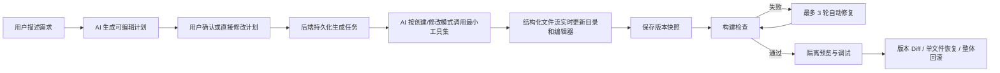

# 灵感工坊 AI 应用生成平台改进复盘

> 复盘范围：2026-08-21 至 2026-08-22 期间，从首次接手项目到当前工作区状态的功能、架构与体验改进。  
> 说明：本文依据当前源码、数据库脚本和本地验证结果整理，不记录账号、密码、密钥等敏感信息。

## 1. 改进目标

接手时，项目已经具备基础的 AI 对话生成、代码保存、预览和部署能力，但整体更接近“可以演示的一次性生成器”，距离可持续使用的 AI Builder 还有以下差距：

- AI 生成依赖浏览器连接，刷新、断线或切换页面后容易丢失过程状态。
- 用户只能看到聊天文字，无法清楚知道 AI 正在修改哪个文件，也缺少完整项目视角。
- 生成结果缺少版本、Diff、构建检查和错误修复闭环，修改风险较高。
- AI 创建项目和修改项目共用提示词及工具，容易出现不必要的工具调用和工具幻觉。
- 文件工具缺少统一路径边界，存在越界访问、超大文件和受保护目录风险。
- 预览、代码、调试、可视化编辑等能力分散，工作区操作效率较低。
- 封面异步生成后不会主动反映到首页，用户必须刷新页面。
- 应用删除只删除主记录会产生代码、版本、对话、部署文件和对象存储垃圾。
- 首页、登录页、工作区和后台列表的视觉层级不统一，产品完成度不足。

因此，本轮工作的核心不是堆叠按钮，而是把流程补成：

## 2. 改进总览

| 能力域 | 本轮改进 | 解决的问题 |
| --- | --- | --- |
| 账号与权限 | 指定账号调整为管理员，保留前后端管理员权限判断 | 无法进入用户、应用管理功能 |
| AI 命名 | 创建应用时由 AI 生成简洁名称，失败时回退到需求摘要 | 项目名称直接截取提示词，可读性差 |
| AI 架构 | 区分 `CREATE` 与 `MODIFY` 的提示词、Service 和工具集 | 工具过多、上下文不匹配、工具幻觉 |
| 流式代码 | 新增结构化文件与增量文件事件 | 代码只能在聊天区看到，文件内容不能实时变化 |
| 项目工作区 | 完整目录树、文件查看、代码/预览切换、可拖动分栏 | 多文件项目难以浏览，预览空间被挤压 |
| Monaco 编辑器 | 使用 Monaco 编辑和保存文件 | 普通文本区域缺少代码编辑体验 |
| 可视化编辑 | 在预览中选中元素并启用 `contentEditable` | 小范围文字修改也必须重新描述给 AI |
| 生成计划 | AI 先生成计划，支持确认、取消返回和直接编辑 | 需求理解错误只能生成后返工 |
| 任务可靠性 2.0 | 任务入库、进度持久化、刷新恢复、SSE 重连、停止与恢复 | 刷新后结果不显示、连接断开即丢状态 |
| 文件安全 | 统一相对路径校验、受保护目录、文件大小与数量限制 | AI 或用户文件操作可能越界或失控 |
| 版本管理 | 自动快照、历史查看、整版本回滚 | 修改不可追溯，失败后无法恢复 |
| 代码 Diff 2.0 | 任意版本对比、逐行增删、并排/统一视图、单文件恢复 | 只能知道“有变化”，不能审查和局部撤销 |
| 构建检测 | Vue 依赖安装与构建检查、静态项目结构检查 | 生成完成不代表项目可运行 |
| 自动修复 2.0 | 构建日志反馈给 AI，最多 3 轮“修改-检查”闭环 | 构建失败后依赖人工反复复制错误 |
| 预览调试 | Console、Network、Build 三类信息回传 | 预览异常只能看到空白页，缺少诊断信息 |
| 预览隔离 | iframe `sandbox`、独立静态预览 URL、调试桥 | 生成页面脚本影响主应用的风险 |
| 封面生成 | 部署后异步截图、数据库更新、首页短轮询刷新 | 封面已生成但必须手动刷新才显示 |
| 部署状态 | 明确运行、暂停、恢复状态并在静态资源层拦截 | 用户不清楚“暂停/恢复”的实际作用 |
| 数据清理 | 单个/批量删除并清理所有关联数据和文件 | 垃圾代码、版本、对话、封面持续堆积 |
| 产品界面 | 首页、登录页、工作区、项目卡片、用户头像统一优化 | 页面粗糙、信息密度与视觉层级不合理 |

## 3. 详细改进说明

### 3.1 管理员权限与后台体验

**为什么需要**

指定用户需要维护用户和应用数据，但普通用户角色无法访问 `/admin` 页面。后台用户列表中的大头像也挤占了表格空间，影响扫描效率。

**怎么实现**

- 在环境数据中将目标账号的 `userRole` 调整为 `admin`，不在源码中硬编码账号。
- 前端路由守卫继续通过 `userRole === 'admin'` 判断管理员路由权限。
- 顶部导航仅向管理员显示“用户管理”和“应用管理”。
- 用户管理表格将头像缩小为 36px，并收紧行内布局。

**关键位置**

- `inspiration-forge-frontend/src/access.ts`
- `inspiration-forge-frontend/src/components/GlobalHeader.vue`
- `inspiration-forge-frontend/src/pages/admin/UserManagePage.vue`

### 3.2 AI 自动生成应用名称

**为什么需要**

直接截取用户提示词会产生过长、带标点或不适合展示的项目名，最近项目列表很难快速识别。

**怎么实现**

- 新增独立的 `AiAppNameService`，让模型只承担短名称生成职责。
- 创建应用时先调用 AI 命名，清理换行与结尾标点，并限制为最多 20 个字符。
- AI 命名失败时退回到压缩后的原始需求，保证创建流程不会因为命名失败而中断。

**关键位置**

- `src/main/java/io/github/onedashboard/inspirationforge/ai/AiAppNameService.java`
- `src/main/java/io/github/onedashboard/inspirationforge/service/impl/AppServiceImpl.java`

### 3.3 创建与修改模式拆分

**为什么需要**

首次创建的目标是从零写出完整项目，后续修改的目标是读取已有代码并做最小修改。两种场景共用提示词和全部工具，会让模型在创建时无意义地读目录，也可能在修改时重建整个项目。

**怎么实现**

- 新增 `GenerationMode.CREATE` 和 `GenerationMode.MODIFY`。
- HTML、原生多文件、Vue 三类生成模式分别增加创建提示词和修改提示词。
- AI Service 工厂的缓存键加入生成模式，避免不同模式错误复用实例。
- 创建模式只提供 `writeFile`、`exit`；修改模式提供读取、修改、写入、删除和退出工具。
- 未知工具调用返回明确错误，降低模型继续编造工具的概率。

**结果**

模型上下文更聚焦，首次生成和增量修改的行为边界更清晰，减少无效工具调用与覆盖已有项目的风险。

**关键位置**

- `src/main/java/io/github/onedashboard/inspirationforge/ai/GenerationMode.java`
- `src/main/java/io/github/onedashboard/inspirationforge/ai/AiCodeGeneratorService.java`
- `src/main/java/io/github/onedashboard/inspirationforge/ai/AiCodeGeneratorServiceFactory.java`
- `src/main/java/io/github/onedashboard/inspirationforge/ai/tools/ToolManager.java`
- `src/main/resources/prompt/codegen-*-create-system-prompt.txt`
- `src/main/resources/prompt/codegen-*-modify-system-prompt.txt`

### 3.4 结构化、实时的文件代码流

**为什么需要**

原先 SSE 主要传递自然语言，前端无法稳定得到“文件名、操作类型、代码内容”。结果是聊天显示完成，但右侧文件或预览没有及时更新；用户也无法看到代码真正生成的过程。

**怎么实现**

- 定义 `code_file` 完整文件事件和 `code_file_delta` 增量事件。
- 在 LangChain4j 的部分工具调用回调中，增量解析 `writeFile` / `modifyFile` 的 JSON 参数。
- `ToolCallCodeStreamParser` 跨分片维护 JSON 字符串、转义字符和 Unicode 状态，逐段解码 `relativeFilePath`、`content`、`newContent`。
- 前端收到增量事件后按文件路径更新内存中的文件内容和流式状态，不再把整段代码堆在聊天气泡里。
- 完成后重新同步后端文件列表并刷新预览，解决“左侧完成、右侧无成品”的时序问题。

**关键位置**

- `src/main/java/io/github/onedashboard/inspirationforge/core/streaming/ToolCallCodeStreamParser.java`
- `src/main/java/io/github/onedashboard/inspirationforge/ai/model/message/CodeFileMessage.java`
- `src/main/java/io/github/onedashboard/inspirationforge/ai/model/message/CodeFileDeltaMessage.java`
- `src/main/java/io/github/onedashboard/inspirationforge/core/AiCodeGeneratorFacade.java`
- `src/main/java/io/github/onedashboard/inspirationforge/core/handler/JsonMessageStreamHandler.java`
- `inspiration-forge-frontend/src/pages/app/AppChatPage.vue`

### 3.5 项目目录、代码编辑与可调分栏

**为什么需要**

多个文件平铺为顶部 Tab 会持续压缩预览高度，也无法表达目录层级。对话、目录树和文件内容固定宽度，在不同屏幕与任务下效率都很低。

**怎么实现**

- 将“代码”和“预览”作为工作区主模式切换，避免长期同时占用垂直空间。
- 根据相对路径构建可展开/折叠的完整项目目录树。
- 点击文件后在独立代码区域查看和编辑具体内容。
- 对话与右侧工作区之间、目录树与编辑器之间增加拖动手柄，并约束最小/最大宽度，避免某一栏被挤没。
- 生成过程中目录和当前文件持续更新；切换文件不弹“未保存确认”，符合实时 AI 文件流的工作方式。
- 调整中间两栏字体和图标尺寸，提高可读性。

**关键位置**

- `inspiration-forge-frontend/src/pages/app/AppChatPage.vue`

### 3.6 Monaco 编辑器与文件保存

**为什么需要**

普通 `textarea` 缺少语法高亮、代码字体、行号、缩进和稳定的大文件编辑体验，不适合作为正式代码工作区。

**怎么实现**

- 引入 `monaco-editor` 并封装 `MonacoCodeEditor.vue`。
- 根据扩展名自动选择语言模式，支持受控内容更新。
- 使用 `ResizeObserver` 在拖动分栏时调用 `editor.layout()`，避免编辑器空白或尺寸错乱。
- 保存时通过 `/app/code/file` 写回工作区，后端校验所有权、路径和文件大小。

**关键位置**

- `inspiration-forge-frontend/src/components/MonacoCodeEditor.vue`
- `inspiration-forge-frontend/src/pages/app/AppChatPage.vue`
- `src/main/java/io/github/onedashboard/inspirationforge/model/dto/app/AppCodeFileUpdateRequest.java`

### 3.7 预览内可视化编辑

**为什么需要**

修改标题、按钮文案等小改动时，让用户重新描述需求并等待 AI 修改成本过高。成熟的 NoCode 产品通常允许直接选中页面元素编辑。

**怎么实现**

- 在预览 iframe 中注入编辑脚本。
- 编辑模式下拦截悬停和点击，生成稳定的元素选择器并显示选中轮廓。
- 对选中元素设置 `contentEditable=true`，光标直接进入页面内容。
- 失焦或快捷键提交后，通过 `postMessage` 将元素选择器和新内容传回父页面。
- 退出编辑模式时清理 `contenteditable`、悬停和选中效果。

**关键位置**

- `inspiration-forge-frontend/src/utils/visualEditor.ts`
- `inspiration-forge-frontend/src/pages/app/AppChatPage.vue`

### 3.8 生成计划及计划内直接修改

**为什么需要**

如果 AI 对页面、功能或技术方案的理解有偏差，直接生成会浪费时间和 Token。只有“取消计划后返回修改需求”仍然会迫使用户重新组织整段描述。

**怎么实现**

- 新增独立的 `AiGenerationPlanService`，先生成名称、目标、页面、功能、技术方案和图片需求。
- 前端用确认弹窗展示计划，同时保留两条路径：取消后返回修改原需求，或直接在计划上修改后继续。
- 后端对用户编辑后的字段做长度、去重和数量约束。
- 最终计划使用明确 XML 边界拼入生成提示词，并声明其优先级高于原始需求。
- 计划服务失败时构造可用的回退计划，不阻塞生成。

**关键位置**

- `src/main/java/io/github/onedashboard/inspirationforge/ai/AiGenerationPlanService.java`
- `src/main/java/io/github/onedashboard/inspirationforge/ai/model/GenerationPlan.java`
- `src/main/java/io/github/onedashboard/inspirationforge/model/dto/app/GenerationPlanRequest.java`
- `inspiration-forge-frontend/src/pages/app/AppChatPage.vue`

### 3.9 任务可靠性 2.0

**为什么需要**

浏览器刷新和 SSE 断线不应该等于停止 AI。此前页面连接中断后，任务进度和结果容易丢失，也正是“新对话正常、旧对话右侧不显示”的重要诱因。

**怎么实现**

- 新增 `generation_task` 表，记录任务类型、模式、状态、当前步骤、当前文件、进度、错误、构建结果和起止时间。
- 后端主动订阅 AI 生成流，通过 `Sinks.Many` 向一个或多个浏览器观察者转发，浏览器离开不再自动取消后端执行。
- SSE 文件事件到达时节流更新任务进度，避免每个 Token 都写数据库。
- 前端打开工作区时查询最新任务；发现运行中任务后恢复 UI、重新连接观察流并同步文件列表。
- SSE 异常时延迟自动重连，而不是立即把任务标记为失败。
- “停止生成”显式释放后端订阅并标记任务/版本为取消；“恢复生成”基于上次取消版本和原始需求发起增量续写。

**关键接口**

- `GET /app/chat/task/latest`
- `GET /app/chat/task/stream`
- `POST /app/chat/cancel`
- `GET /app/chat/resume`

**当前边界**

任务元数据可以跨页面刷新恢复，但实时 `Sinks` 和模型 Token 流仍在进程内。若后端服务本身重启，系统可以识别未完成任务，却不能从精确 Token 位置继续原来的模型连接。

### 3.10 文件安全

**为什么需要**

AI 文件工具和用户编辑接口都接收相对路径。若各工具分别拼接路径，容易出现 `../` 越界、绝对路径、符号链接绕过、写入 `.env` 或 `node_modules` 等问题。

**怎么实现**

- 新增统一的 `ProjectPathGuard`，所有 AI 工具和用户保存接口共用同一套路径策略。
- 只允许项目相对路径，拒绝绝对路径、盘符、空字符、`.` 和 `..` 路径段。
- 禁止访问 `.env`、`.git`、`node_modules`。
- 规范化后再次检查目标路径必须位于项目根目录内。
- 拒绝经过符号链接的路径。
- 单文件限制 5 MB，项目遍历最多 5000 个文件；Diff 对不可读或超大内容做降级处理。

**关键位置**

- `src/main/java/io/github/onedashboard/inspirationforge/security/ProjectPathGuard.java`
- `src/main/java/io/github/onedashboard/inspirationforge/ai/tools/File*Tool.java`
- `src/main/java/io/github/onedashboard/inspirationforge/service/impl/AppServiceImpl.java`

### 3.11 应用版本管理与回滚

**为什么需要**

AI 修改具有不确定性。如果没有版本快照，错误修改会直接覆盖上一次可用结果，用户也无法知道当前处于第几版。

**怎么实现**

- 新增 `app_version` 表，记录应用、版本号、生成类型、快照路径、状态和变更说明。
- `app` 表增加 `currentVersionId`、`versionNumber`、`generationStatus` 和 `deployStatus`。
- 每次生成或自动修复开始时创建 `GENERATING` 版本；生成完成后复制工作区快照并标记 `READY`。
- 失败或取消时同步版本状态，防止把不完整内容当作可回滚版本。
- 回滚时校验版本属于当前应用、状态为 `READY`、快照位于受控版本根目录，然后替换工作区。
- 若应用当前正在运行，回滚后同步部署文件并重新触发封面。
- 修复了前端传版本号而后端需要版本记录 ID 导致“版本不存在”的问题，统一使用 `version.id`。

**关键接口**

- `GET /app/version/list`
- `POST /app/version/rollback`

### 3.12 代码 Diff 2.0 与单文件恢复

**为什么需要**

版本历史只能回答“什么时候生成过”，不能回答“改了什么”。整版本回滚粒度过大，用户经常只想恢复一个文件。

**怎么实现**

- 引入 `java-diff-utils`，以行为单位计算真实 Patch。
- 支持“任意 READY 版本 vs 任意 READY 版本”以及“历史版本 vs 当前工作区”。
- 返回文件状态、增删行数、Unified Diff 和结构化逐行数据。
- 前端提供文件列表、增删统计、并排视图和统一视图；较长上下文折叠为 HUNK。
- 支持将当前工作区的单个文件恢复到基准版本。
- 单文件恢复前备份原内容；Vue 项目恢复后必须重新构建；构建失败则恢复原文件，成功后创建新版本而不是改写历史版本。

**关键接口**

- `GET /app/version/diff`
- `POST /app/version/file/restore`

**关键位置**

- `src/main/java/io/github/onedashboard/inspirationforge/model/vo/CodeFileDiffVO.java`
- `src/main/java/io/github/onedashboard/inspirationforge/model/vo/CodeDiffLineVO.java`
- `inspiration-forge-frontend/src/pages/app/AppChatPage.vue`

### 3.13 构建检测与自动修复闭环 2.0

**为什么需要**

模型回复完成或文件成功写入，并不代表 Vue 项目能安装依赖、编译并生成 `dist`。没有构建检查，错误只会在用户预览或部署时暴露。

**怎么实现**

- Vue 项目依次执行 `npm install --no-audit --no-fund` 和 `npm run build`。
- 依赖安装最长 300 秒，构建最长 180 秒；超时后强制终止进程。
- 保留最近 60,000 字符构建日志，返回失败阶段、耗时和输出，避免日志无限占用内存。
- 静态项目检查根目录是否存在 `index.html`。
- 构建失败后，用户确认即可启动自动修复；后端把失败阶段和截断后的日志放入修改模式提示词。
- 每一轮执行“AI 修改 -> 重新构建 -> 判断结果”，最多 3 轮；通过即停止，仍失败则提示人工处理。
- 每轮自动修复都是独立任务和独立版本，便于追踪与撤销。

**关键接口**

- `POST /app/build/check`
- `GET /app/chat/repair/build`

**说明**

这里的“构建”是对生成项目的本地可运行性检查，不等于把平台或作品发布到线上。

### 3.14 预览隔离与调试工具

**为什么需要**

生成页面可能存在 JavaScript 运行错误、接口 404 或 Promise 异常。只显示 iframe 会让用户看到空白，却不知道原因；同时生成代码不应获得主应用的完整能力。

**怎么实现**

- iframe 使用 `sandbox="allow-scripts allow-same-origin allow-forms allow-popups"`，不开放顶层导航等额外权限。
- 静态资源控制器向预览 HTML 注入调试桥。
- 调试桥包装 `console`、`fetch`、`XMLHttpRequest`，监听运行错误与未处理 Promise，并通过 `postMessage` 回传。
- 工作区增加 Console、网络和构建三个调试 Tab，可清空日志并查看错误数量。
- 预览刷新增加时间戳，避免浏览器缓存导致“文件已变但页面不变”。

**关键位置**

- `src/main/java/io/github/onedashboard/inspirationforge/controller/StaticResourceController.java`
- `inspiration-forge-frontend/src/pages/app/AppChatPage.vue`

### 3.15 封面生成与自动显示

**为什么需要**

部署接口先返回，截图在后台异步生成。数据库后来有了封面，但首页列表不会自动重新请求，所以只能刷新页面后看到；截图失败时也缺少明确日志。

**怎么实现**

- 部署成功后在虚拟线程中调用截图服务并上传对象存储。
- 截图成功后独立更新 `app.cover`，失败记录应用 ID、URL 和异常，且不影响部署主流程。
- 首页发现“已部署但没有封面”的项目后，每 3 秒重新拉取列表，最多轮询 20 次；封面到达或达到上限即停止。
- 应用卡片提供封面生成中和等待部署的明确占位状态。

**关键位置**

- `src/main/java/io/github/onedashboard/inspirationforge/service/impl/AppServiceImpl.java`
- `inspiration-forge-frontend/src/pages/HomePage.vue`
- `inspiration-forge-frontend/src/components/AppCard.vue`

### 3.16 部署暂停与恢复

**为什么需要**

部署后的应用需要临时停止公开访问，但用户不一定希望删除部署文件或重新部署。

**怎么实现**

- `deployStatus` 维护 `NOT_DEPLOYED`、`RUNNING`、`PAUSED` 状态。
- “暂停”只改变访问状态，不删除代码、部署目录或 `deployKey`。
- 静态资源控制器在 `PAUSED` 时拒绝提供部署内容。
- “恢复”把状态改回 `RUNNING`，原访问地址继续使用。

这解释了页面顶部“暂停/恢复”的含义：它控制作品是否可公开访问，不是暂停 AI 生成，也不是删除部署。

### 3.17 应用删除与关联数据清理

**为什么需要**

应用主记录之外还存在本地代码、版本快照、对话历史、Redis AI 记忆、部署目录和对象存储封面。只逻辑删除应用会形成大量孤儿数据。

**怎么实现**

- 最近项目支持单个删除、选择模式、当前页全选和批量删除。
- 批量接口去重并限制每次最多 50 个，只允许删除自己的应用。
- 删除前停止活跃生成订阅并关闭实时流。
- 清理聊天记录、版本记录、Redis 记忆和 AI Service 缓存。
- 删除生成目录、版本快照目录和部署目录。
- 删除对象存储封面，最后永久删除应用主记录。
- 清理过程使用事务覆盖数据库操作；文件和对象存储失败记录日志，避免静默遗漏。

**关键接口**

- `POST /app/delete`
- `POST /app/batch/delete`

### 3.18 前端产品体验统一

**为什么需要**

首页原本像后台表单，登录页输入框横跨页面，工作区控件层级不清晰。即使功能完整，用户仍会认为产品粗糙且不知道第一步该做什么。

**怎么实现**

- 首页参考成熟 NoCode 产品，改为居中的需求输入、清晰标题、快捷灵感和自然衔接的“我的作品 / 灵感广场”。
- 统一青绿色品牌主色、字体、边框、按钮、卡片和页面背景。
- 项目卡片强化封面、状态、应用类型、编辑、预览和删除动作。
- 登录页改为独立全屏双栏布局：左侧品牌与工作区场景，右侧紧凑账号密码表单。
- 登录表单增加明确标签、图标、密码显示控制、提交加载、异常处理、免费注册和返回首页。
- 移动端登录页收敛为单列卡片，首页和工作区增加响应式约束，避免文字与控件重叠。
- 登录页隐藏全局导航和页脚，消除重复品牌及已登录账号菜单干扰。

**关键位置**

- `inspiration-forge-frontend/src/pages/HomePage.vue`
- `inspiration-forge-frontend/src/pages/user/UserLoginPage.vue`
- `inspiration-forge-frontend/src/pages/app/AppChatPage.vue`
- `inspiration-forge-frontend/src/components/GlobalHeader.vue`
- `inspiration-forge-frontend/src/components/AppCard.vue`
- `inspiration-forge-frontend/src/layouts/BasicLayout.vue`
- `inspiration-forge-frontend/src/App.vue`

## 4. 数据模型变化

### 4.1 `app` 新增状态字段

| 字段 | 用途 |
| --- | --- |
| `currentVersionId` | 当前工作版本记录 ID |
| `versionNumber` | 当前版本号 |
| `generationStatus` | `IDLE / GENERATING / COMPLETED / FAILED / CANCELLED` |
| `deployStatus` | `NOT_DEPLOYED / RUNNING / PAUSED` |

### 4.2 `app_version`

保存每次生成、修改、修复和恢复产生的版本元数据及文件快照路径。版本状态用于区分生成中、可使用、失败和取消的版本。

### 4.3 `generation_task`

保存生成与自动修复任务的实时状态。关键字段包括：

- `taskType`：普通生成或自动修复。
- `attempt / maxAttempts`：自动修复轮次。
- `currentStep / currentFile / progress`：页面恢复和进度显示。
- `buildStatus / buildOutput`：构建闭环结果。
- `startedAt / finishedAt / errorMessage`：任务审计与问题定位。

数据库定义位于 `sql/create_table.sql`，本地开发数据库已同步新增字段。

## 5. 关键接口变化

| 接口 | 作用 |
| --- | --- |
| `POST /app/chat/plan` | 生成可编辑的生成计划 |
| `GET /app/chat/gen/code` | 按确认后的需求与计划生成代码 |
| `GET /app/chat/task/stream` | 重新观察正在运行的任务流 |
| `GET /app/chat/task/latest` | 查询最新持久化任务状态 |
| `POST /app/chat/cancel` | 显式停止生成 |
| `GET /app/chat/resume` | 恢复已取消任务 |
| `GET /app/code/files` | 获取完整项目文件列表 |
| `POST /app/code/file` | 保存单个代码文件 |
| `POST /app/build/check` | 执行构建或结构检查 |
| `GET /app/chat/repair/build` | 根据构建错误发起一轮 AI 修复 |
| `GET /app/version/list` | 获取版本历史 |
| `POST /app/version/rollback` | 整体回滚到历史版本 |
| `GET /app/version/diff` | 对比两个版本或版本与工作区 |
| `POST /app/version/file/restore` | 恢复单个文件并创建新版本 |
| `POST /app/deploy/start` | 恢复部署访问 |
| `POST /app/deploy/stop` | 暂停部署访问 |
| `POST /app/batch/delete` | 批量删除应用和关联数据 |

## 6. 验证情况

本轮已执行并通过的验证包括：

- 后端 Java 编译检查：`mvn compile`。
- 前端类型检查：`vue-tsc --noEmit` / `vue-tsc --build`。
- 流式 JSON 参数解析单元测试。
- Git 差异格式检查：`git diff --check`。
- 本地浏览器验证：首页、登录页、工作区、版本与 Diff 入口、表单校验、布局和横向溢出。
- 此前执行过 Maven `package` 和 Vite `build-only`，用途是本地构建验证，不是部署。

本轮没有把平台或作品发布到远程环境，也没有执行线上部署操作。

## 7. 当前已知边界与后续建议

### 7.1 当前边界

1. 生成任务可以跨页面刷新恢复，但不能在后端进程重启后从原 Token 位置续传。
2. 自动修复闭环由前端依次触发“修复流”和“构建检查”，最大 3 轮；尚未改为完全由后端编排的持久化工作流。
3. 封面刷新采用有限短轮询，能解决常规异步延迟，但尚未通过 WebSocket/SSE 推送封面完成事件。
4. 可视化编辑主要适合文字内容。复杂 DOM 结构、样式属性和跨组件 Vue 状态仍应通过代码或 AI 修改。
5. 版本快照当前保存在本地文件系统，服务多实例部署前需要迁移到共享存储或对象存储。
6. 本轮按需求暂未实施“密钥配置安全”改造；该事项应在进入生产环境前单独处理，并进行密钥轮换。

### 7.2 建议的下一阶段

1. 将任务执行迁移为可恢复的队列/工作流，引入任务租约、心跳、幂等键和服务重启接管。
2. 把自动修复改为后端状态机，页面只观察状态，避免关闭页面影响修复轮次推进。
3. 增加生成质量评估：页面可访问性、响应式截图对比、关键交互自动化测试。
4. 将版本快照与构建产物迁移到共享对象存储，并增加生命周期清理策略。
5. 完成密钥配置安全：移出源码、使用环境变量或密钥服务、最小权限、日志脱敏和轮换。
6. 为删除、回滚、单文件恢复和自动修复增加更完整的集成测试。

## 8. 总结

本轮改造把系统从基础 AI 生成 Demo 推进为具备以下完整链路的应用生成工作台：

> 需求澄清与计划确认 → 可靠生成 → 实时文件流 → 代码编辑与预览 → 构建诊断 → 自动修复 → 版本审查与恢复 → 部署状态管理 → 数据全生命周期清理。

其中最重要的变化不是某一个页面，而是建立了“生成过程可观察、生成结果可验证、代码修改可追溯、失败操作可恢复、用户数据可清理”的系统基础。
